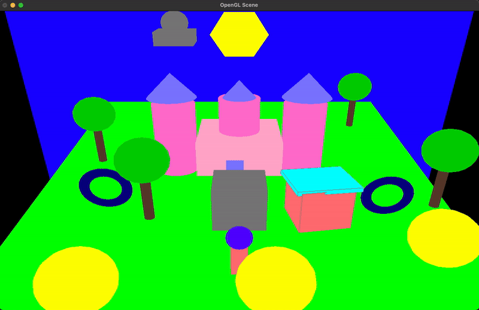
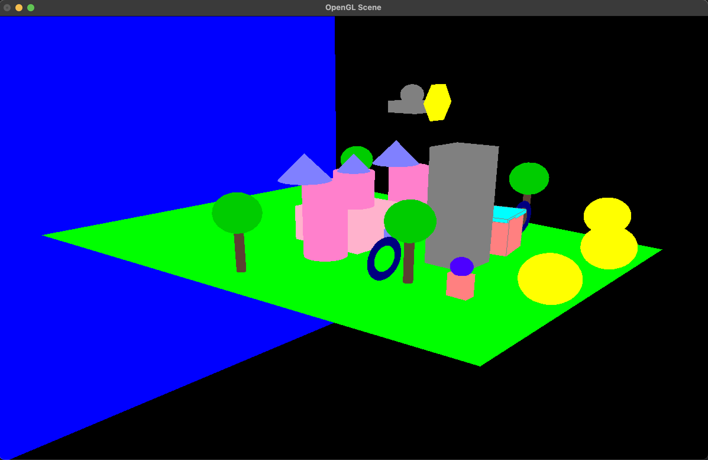

# OpenGL Scene

This project is an interactive OpenGL scene featuring various objects including a robot, a rocket, a palace, trees, and more. The scene includes collision detection, lighting, and basic keyboard controls for navigation and interaction.



## Prerequisites

- OpenGL
- GLUT (OpenGL Utility Toolkit)

## Installation

1. Ensure you have OpenGL and GLUT installed on your system.
2. Clone this repository to your local machine.

## Building and Running

1. Navigate to the project directory.
2. Compile the code using a C++ compiler with OpenGL and GLUT support. For example, using `g++`:

    ```bash
    g++ -o OpenGLScene main.cpp -lGL -lGLU -lglut
    ```

3. Run the compiled executable:

    ```bash
    ./OpenGLScene
    ```
### Note for Windows Users

This project uses headers that are specific to macOS and Xcode. If you are compiling this project on Windows, you can use the the following GLUT header:

    
    #include <GLUT/glut.h>
    


## Controls

### Robot Movement

- **Arrow Keys**: Move the robot around the scene.

### Camera Movement

- **'l'**: Move the camera left.
- **'r'**: Move the camera right.
- **'f'**: Move the camera forward.
- **'b'**: Move the camera backward.


## Features

- **Robot**: A 3D model that can be moved around using the arrow keys.
- **Rocket**: Moves automatically in the scene at a constant speed.
- **Palace**: A stationary 3D model in the scene.
- **Trees and Bushes**: Additional stationary objects for visual interest.
- **Lighting**: Basic lighting setup using OpenGL's lighting model.
- **Collision Detection**: Detects collisions between the robot and various objects in the scene.
- **Boxes (Buildings)**: Three box models that appear on top of each other when the player collides with yellow balls.
## Code Overview

- **initLighting()**: Initializes the lighting for the scene.
- **drawRobot()**: Draws the robot at its current position.
- **drawBush()**: Draws a bush model.
- **drawTorus()**: Draws a torus.
- **checkCollision()**: Checks for collisions between the robot and other objects.
- **drawTrees()**: Draws multiple trees in the scene.
- **updateRocketPosition()**: Updates the rocket's position.
- **drawRocket()**: Draws the rocket at its current position.
- **specialKeys()**: Handles special key presses for robot movement.
- **handleKeyboard()**: Handles standard key presses for camera and rocket movement.
- **drawPalace()**: Draws the palace model.
- **drawPolygon()**: Draws a polygon.
- **drawHouse()**: Draws a house model.
- **drawRing()**: Draws a ring.
- **yellowball()**, **yellowball2()**, **yellowball3()**: Draws yellow balls at specific positions.
- **display()**: The main display function, responsible for rendering the entire scene.
- **initEnvironment()**: Initializes the OpenGL environment.
- **reshape()**: Handles window resizing.
- **timer()**: A timer function to update the display periodically.
## License

This project is licensed under the MIT License. See the `LICENSE` file for details.

## Acknowledgements

- OpenGL Community for extensive documentation and examples.
- GLUT for providing an easy-to-use interface for OpenGL.


